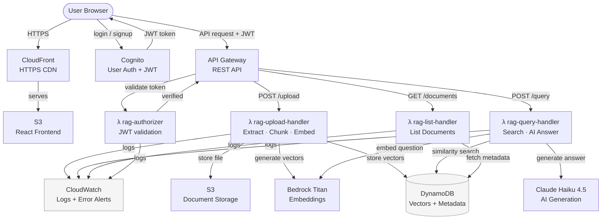

# Cloud Computing RAG System

A fully serverless Retrieval-Augmented Generation (RAG) system built on AWS. Users authenticate, upload documents (PDF, DOCX, TXT), and ask natural language questions answered by AI grounded exclusively in their uploaded content.

**GitHub Repository:** https://github.com/sem2-projects/Cloud-Computing-RAG  
**Live Website:** https://d2dqj0m7kr4lcj.cloudfront.net

---

## Project Overview

Traditional AI answers questions from its training data, which can be outdated or hallucinated. RAG solves this by retrieving relevant passages
from your own documents and using them as context for AI generation so every answer is grounded in real, verifiable source material.

This system lets any authenticated user upload their documents and immediately query them with natural language. The AI cites exactly which document and passage each answer came from.

**Use cases:** Research paper Q&A, business document search,
study assistant, knowledge base querying.

---

## Architecture Diagram

The diagram below shows the complete request flow. 



**Upload flow:** User → CloudFront → API Gateway → λ authorizer validates JWT
→ rag-upload-handler extracts text → chunks into 500-word segments
→ Bedrock Titan generates embeddings → stored in DynamoDB + S3

**Query flow:** User question → API Gateway → rag-query-handler embeds question
→ cosine similarity search against DynamoDB vectors → top 5 chunks
sent to Claude Haiku → grounded answer returned with source citations

**Observability:** All Lambda functions log to CloudWatch.
Error alarms notify via SNS email when any function fails.


## AWS Services Used

| Service | Purpose |
|---|---|
| AWS Lambda | Serverless compute: all backend logic |
| API Gateway | REST API with JWT authorization |
| Amazon Cognito | User authentication and JWT token issuance |
| Amazon Bedrock (Titan) | Text embedding generation (1536-dim vectors) |
| Amazon Bedrock (Claude Haiku 4.5) | AI answer generation |
| Amazon DynamoDB | Vector storage and document metadata |
| Amazon S3 | Document file storage + React frontend hosting |
| Amazon CloudFront | HTTPS CDN for frontend delivery |
| AWS IAM | Least-privilege execution roles per Lambda |
| Amazon CloudWatch | Logging and error alerting |

---

## How RAG Works

**Upload pipeline:**
1. User uploads PDF, DOCX, or TXT through the React UI
2. `rag-upload-handler` extracts raw text from the file
3. Text is split into 500-word chunks with 50-word overlap
4. Each chunk is sent to Bedrock Titan → returns a 1536-dimension embedding vector
5. Chunk text + vector + metadata stored in DynamoDB
6. Original file stored in S3

**Query pipeline:**
1. User types a natural language question
2. `rag-query-handler` converts question to a vector using Bedrock Titan
3. All stored chunk vectors are retrieved from DynamoDB
4. Cosine similarity is calculated between question vector and every chunk
5. Top 5 most relevant chunks are selected
6. Question and relevant chunks sent to Claude Haiku as context
7. Claude generates a grounded answer citing source documents
8. Answer and sources returned to frontend

---

## Project Structure
```
Cloud-Computing-RAG/
├── src/
│   ├── app.jsx                   # React app: auth, upload, query, documents UI
│   └── main.jsx                  # React entry point
├── lambda_functions/
│   ├── rag-upload-handler/
│   │   ├── lambda_function.py    # Upload pipeline: extract, chunk, embed, store
│   │   └── requirements.txt
│   ├── rag-query-handler/
│   │   ├── lambda_function.py    # Query pipeline: embed, search, Claude generation
│   │   └── requirements.txt
│   ├── rag-list-handler/
│   │   ├── lambda_function.py    # List user's documents from DynamoDB
│   │   └── requirements.txt
│   └── rag-authorizer/
│       ├── lambda_function.py    # Validates Cognito JWT tokens
│       └── requirements.txt
├── index.html
├── vite.config.js
├── package.json
├── package-lock.json
└── README.md
```

## Team Contributions

| Person | Role | Responsibilities |
|---|---|---|
| Fareed Durgam | Frontend + Auth | React UI, Cognito sign-up/sign-in flows, JWT token handling |
| Dharma Swaroop | Infrastructure | API Gateway, IAM roles, CloudWatch, S3, DynamoDB, Lambda scaffolding |
| Sagar Kumar | RAG Pipeline | Lambda business logic, Bedrock embeddings, cosine similarity, Claude generation |

---

## Local Setup & Deployment

### Prerequisites
- AWS account with Bedrock access (Titan Embeddings + Claude Haiku 4.5)
- Node.js 18+, Python 3.12+, AWS CLI configured

### Frontend
```bash
npm install
npm run build
aws s3 sync dist/ s3://YOUR-FRONTEND-BUCKET --delete

### Lambda Functions
```bash
cd lambda_functions/FUNCTION_NAME
pip install -r requirements.txt \
  --target . \
  --platform manylinux2014_x86_64 \
  --implementation cp \
  --python-version 3.12 \
  --only-binary=:all:
zip -r ../FUNCTION_NAME.zip .
aws lambda update-function-code \
  --function-name FUNCTION_NAME \
  --zip-file fileb://../FUNCTION_NAME.zip
```

---

## Cost Analysis

| Service | Development | 100 users/month | 1000 users/month |
|---|---|---|---|
| Lambda | $0 (free tier) | ~$0.20 | ~$2.00 |
| API Gateway | $0 (free tier) | ~$0.35 | ~$3.50 |
| Bedrock Titan | ~$0.01 | ~$2.00 | ~$20.00 |
| Claude Haiku 4.5 | ~$0.05 | ~$5.00 | ~$50.00 |
| DynamoDB | $0 (free tier) | ~$1.00 | ~$8.00 |
| S3 + CloudFront | ~$0 | ~$0.50 | ~$2.00 |
| **Total** | **~$0.06** | **~$9.05** | **~$85.50** |

